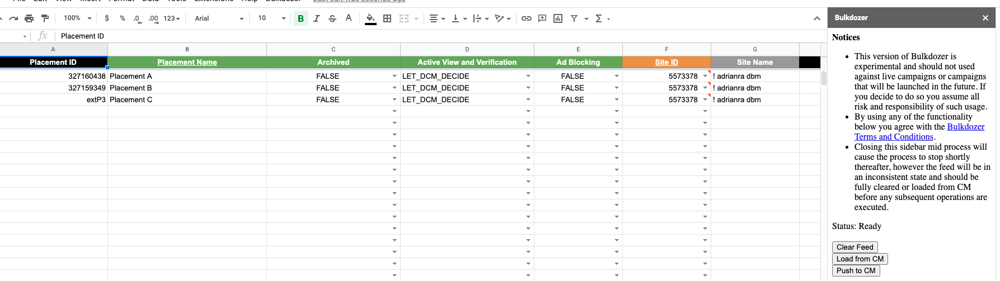
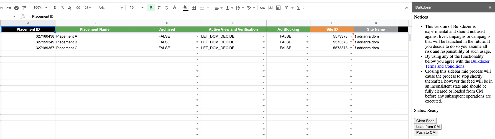

# Bulkdozer

- [Bulkdozer](#bulkdozer)
  - [Solution Overview](#solution-overview)
  - [Solution Requirements](#solution-requirements)
  - [Installation](#installation)
    - [Apps Script Advanced Service Configuration](#apps-script-advanced-service-configuration)
  - [Solution Manual](#solution-manual)
    - [**Solution Setup, Basics & Legend**](#solution-setup-basics--legend)
    - [**Color Legend**](#color-legend)
    - [**Guide: Event Tag Creation for Existing Campaign**](#guide-event-tag-creation-for-existing-campaign)
    - [**Guide: Create New Ads, Assign to Placements**](#guide-create-new-ads-assign-to-placements)
    - [**Guide: Bulk Creative Swap**](#guide-bulk-creative-swap)
- [Terms and Conditions](#terms-and-conditions)
  - [Support](#support)
  - [Other Resources](#other-resources)

## Solution Overview

Bulkdozer is a Google Sheets-based tool leveraging Apps Script and the CM360 API to load and visualize CM360 campaign data, allowing the user to traffic more efficiently at scale. Bulkdozer can create and edit Campaigns, Placement Groups, Placements, Ads, Creative Assignments, Landing Pages and Event Tags.

## Solution Requirements

- Products
  - Campaign Manager 360
  - Google Workspace (Google Sheets)

## Installation

Use the link below to navigate to the tool. Refer to the
"Instructions" tab of for details on how to deploy and use the solution.

- [Bulkdozer 0.4](https://docs.google.com/spreadsheets/d/1jVXiLiAS_n9-7v7Ekw52UzNE2bEiCi7CCmjWxKB7kcw/edit?usp=sharing)

### Apps Script Advanced Service Configuration
Due to recent Apps Scripts changes, an extra configuration is required for Bulkdozer to work properly. Please follow the steps below:
1. In your Bulkdozer Google Sheet copy navigate from menu 'Tools' > 'Script Editor'.
2. In the Script Editor, navigate to the 'Editor' tab in the outer left nav (icon looks like '< >' brackets)
3. Under the 'Services' section of the inner left nav, click on the vertical three-dots next to the 'DoubleClickCampaigns' service and click 'Remove' and then click 'Remove service' on the confirmation pop-up.
4. Click the '+' button next to Services in the inner left nav to re-add the service.
5. In the list of services select 'Campaign Manager 360 API' and check that the version is 'v4' at this time and that the 'Identifier' is the same 'DoubleClickCampaigns'.

## Solution Manual

### **Solution Setup, Basics & Legend**

1. Make a Copy of the Bulkdozer Google Sheet [Bulkdozer 0.4](https://docs.google.com/spreadsheets/d/1jVXiLiAS_n9-7v7Ekw52UzNE2bEiCi7CCmjWxKB7kcw/edit?usp=sharing)

2. Your permissions in Bulkdozer are tied to your CM360 Profile’s Permission for a given CM360 Account. In the Store tab, next to profileid (Row 2B), input your CM360 Profile ID for the appropriate CM360 Account that you will be trafficking in. Without this, Bulkdozer will not work.

3. **The Bulkdozer Sidebar:** The Bulkdozer sidebar is where you access all Bulkdozer functionality. To open the sidebar select the custom menu at the top Bulkdozer -> Open.

      - **Status:** The "Status" text tells you what Bulkdozer is currently doing. "Ready" means it is not executing any jobs and it is ready to process your next command. When jobs are running, this status text changes to reflect the actions that are being performed. Ensure you see “Ready” everytime after Loading From/Clearing Feed/Pushing To CM.

      - **Clear Feed:** This button will clear CM data from all tabs in the feed, preparing it for the next activity, such as switching to work on a new campaign. In general, best practice is to Clear Feed before each use.

      - **Load from CM:** This button will load data from CM

         - Which data to load is identified by the IDs in the ID columns of the respective tabs. For instance, if you would like to load all entities under a given Campaign, enter the Campaign ID in the Campaign ID column of the Campaign tab and click Load from CM.

      - **Push to CM:** This button will push any feed changes back to CM.

         - Bulkdozer loads data from CM based on IDs you input in the respective tabs. You can load entire campaigns or specific Placement Groups, Placements, and Ads. Bulkdozer will load items in "cascade", e.g. if you decide to load a Campaign(s) everything under the specified Campaign(s) will be loaded. If you decide to load Placements, everything under the placements will be loaded but not upstream items such as Campaigns or Placement groups. This behavior is intended to allow you to load only the specific items you want to modify.

         - Next, go to the tab that represents the top level entities you want to load. E.g. if you want to load an entire Campaign go to the Campaign Tab and enter the appropriate CM360 Campaign ID in the Campaign ID field. If you only wanted to load specific placements go to the Placement tab and enter the Placement IDs instead, and so on.

         - You can also mix and match, for instance you could load 1 entire campaign, 3 placement groups from another campaign, and 2 placements from yet another placement group by specifying the correct ids in the correct tabs. Bulkdozer’s power is in its flexibility to bulk edit across many Placements, Campaigns and Advertisers. You may very well choose to pull in several Campaigns and traffic them all at once in a single sheet.

         - Finally open the sidebar and click "Load from CM". Monitor the Log tab until the sidebar status changes to "Ready", which indicates the loading process is complete and CM data is populated in the respective tabs.

[Back to top](#top_page)

### **Color Legend**

* **Orange:** User provided, used on insert only, not updateable after initial creation.

* **Black: IDs. User provided:**
  - In the “ext..” format for initial creation or, actual IDs for existing items for mapping purposes.
    - **Creating new entities, the “ext..” format:**
    - Seen below, there are two existing Placements in this CM Campaign. We are telling Bulkdozer to create a third placement by entering “extP3” in the Placement ID field, while also filling out the other fields. This is what your entry might look like BEFORE clicking “Push to CM”:
    
    - Once the push is completed (Status: Ready), extP3 will be replaced by the newly created CM360 Placement ID, looking something like this:
    
    - You can use any alphanumeric combination after ext to notate a new entry. You could just as easily use “extNewThing99” in this Placement ID example to create an additional Placement. We advise on simple naming conventions to make it easier to manage, such as “extP1” and “extP2” for two new unique Placements, “extA1” for a new Ad, “extC1” for a new Campaign, etc.

* **Gray:** Populated upon “Load From CM” by Bulkdozer for trafficker convenience.
  - Example, in the Placement tab the Campaign Name column is provided so you know the Campaign with which a Placement is tied to but- it is not an editable field.
  - Not used for insert or update.

* **Green:** Updateable fields, used for inserting new items, and can be updated in subsequent executions.

Column Headers that are underlined are required fields for their tab.

[Back to top](#top_page)

### **Guide: Event Tag Creation for Existing Campaign**
  1. Load From CM: at the Campaign-level. Enter the appropriate Campaign ID in the that field on the Campaign tab

2. Let's create a new Event Tag that we will apply in bulk to all Ads under one of our Placements.

3. Go to the Event Tag tab enter a new row:
    - Advertiser ID: The same Advertiser ID as your campaign, refer to the Campaign tab.
    - Campaign ID: Select your campaign ID from the dropdown.
    - Event Tag ID: extET1
    - Event Tag Name: Bulkdozer Event Tag 1
    - Event Tag Status: (ENABLED)
    - Enable By Default: (TRUE or FALSE)
    - Event Tag Type: (Image or Script)
    - Event Tag URL: Any valid url starting with https://

4. Associate Event tag to an Ad
    - Navigate to the Event Tag Ad Assignment tab:
      - Event Tag ID: Select EXT1 from dropdown
      - Ad ID: Select appropriate Ad ID from dropdown
Status: Select ACTIVE from dropdown

5. Push to CM

[Back to top](#top_page)

### **Guide: Create New Ads, Assign to Placements**

1. Load From CM: at the Campaign-level. Enter the appropriate Campaign ID in the that field on the Campaign tab

2. Create a new Ad
     - Go to the Ad tab and add a new row with the following:
       - Campaign ID: Pick the campaign ID from the drop down.
       - Ad Type: AD_SERVING_DEFAULT_AD
       - Ad Priority: AD_PRIORITY_1
       - Ad ID: extAD1
       - Ad Name: Bulkdozer new ad in existing campaign
       - Ad Start Date: Same as the start date in the Campaign tab
       - Ad End Date: Same as the end date in the Campaign tab
     - Fields not mentioned above can be left blank.

3. Assign new Ad to existing Placements: In the Ad Placement Assignment tab, add a new row:
     - Placement ID: Pick an existing placement ID from the drop down.
     - Ad ID: extAD1

4. Assign existing creative to new Ad: In the Ad Creative Assignment tab, add a new row and include:
   - Ad ID: extAD1
   - Creative ID: Pick a creative ID from the drop down.
   - Fields not mentioned above can be left blank.

5. Push to CM

[Back to top](#top_page)

### **Guide: Bulk Creative Swap**

**Important:** Bulkdozer helps with the swapping of Creative assignments. However, the actual creative must be previously loaded into either the Advertiser or (preferably) the Campaign. Bulkdozer does not facilitate the uploading of creatives.

1. Load From CM: at the Campaign-level. Enter the appropriate Campaign ID in the that field on the Campaign tab

2. (Skip this step if the creative is already uploaded to the Campaign-level) Pull Creative stored in the CM Advertiser into a specific Campaign. Go to the Creative Tab and enter a new row including:
   - Advertiser ID: The Advertiser ID associated with the applicable Campaign and Creative.
   - Campaign ID: Select your Campaign in the drop down.
   - Creative ID: The ID of the Creative you want to import from the Advertiser-level to the Campaign-level for assigning
   - Creative Name: Name of the Creative you want to import from the Advertiser-level to the Campaign-level for assigning (To note: what is entered here will replace that Creative’s Name at both the Advertiser and Campaigns-level. Leave blank if keeping the existing name)

3. Swap the creatives
   - Go to the Ad Creative Assignment tab, and update the Creative ID Column to be the ID of the Creative you want to swap in to each respective Ad.

4. Push to CM

[Back to top](#top_page)

# Terms and Conditions

By using Bulkdozer the user agrees with the
[Terms & Conditions](Terms_and_Conditions.md).

[Back to top](#top_page)

## Support

Bulkdozer is community supported, if you have any issues or questions please post a new issue [here](https://github.com/google/bulkdozer/issues).

Sign up for updates and announcements:
[Bulkdozer Announcements](https://groups.google.com/forum/#!forum/bulkdozer-announcements).

[Back to top](#top_page)

## Other Resources

The files below are a simplified version of [Bulkdozer 0.4](https://docs.google.com/spreadsheets/d/1jVXiLiAS_n9-7v7Ekw52UzNE2bEiCi7CCmjWxKB7kcw/edit?usp=sharing) and only include a specific Bulkdozer feature.

**These modules are not actively maintained**
- [QA Tools 0.15](https://docs.google.com/spreadsheets/d/10sZGoK8Z9BMb_6QKeOzJ4D698mJ4mNbtDY8ASfoyh9I/edit?usp=sharing)
- [Event Tag QA Tool](https://docs.google.com/spreadsheets/d/1Pj4DqHibkTSoo6zQGDpksxpnxyhojNa3pBkMAvX0p6A/edit?usp=sharing&resourcekey=0-Vw7rukq3OH8cZLPR4IEk5g)
- [Event Tag Editor 0.4](https://docs.google.com/spreadsheets/d/1_ox81ztsuxVaNsEjYvr783urGP41Hv1vnyP-hl0kUKo/edit?usp=sharing&resourcekey=0-CWepPTVXFFaBDg0CvD4rzg)
- [Landing Page QA Tool & Editor 0.5](https://docs.google.com/spreadsheets/d/1TB9FxPfMWvaCikWvhMKnkfT-rd9LQskI-VI7QaVFJ7s/edit?usp=sharing)
- [Key Value Editor 0.4](https://docs.google.com/spreadsheets/d/1Fn7sOlw89gC2mwedM1aSE0r-8l7hCWLFKYOZMfEG-F0/edit?usp=sharing&resourcekey=0-9ZmyZDAy0Yc75kUuagRecQ)
- [Cost Editor 0.4](https://docs.google.com/spreadsheets/d/1PKtDaEeWUUt-22VxWqBqrAZ4ZohllCswA6d9EMJUIBc/edit?usp=sharing&resourcekey=0-jLeKkIWxah0YaHrdfab7nQ)
- [Creative Loader 0.7](https://docs.google.com/spreadsheets/d/1U6LJesagSfb_jQbS-JZsqvt-3CEyB0mciO84SqiF_yc/edit?usp=sharing)

[Back to top](#top_page)